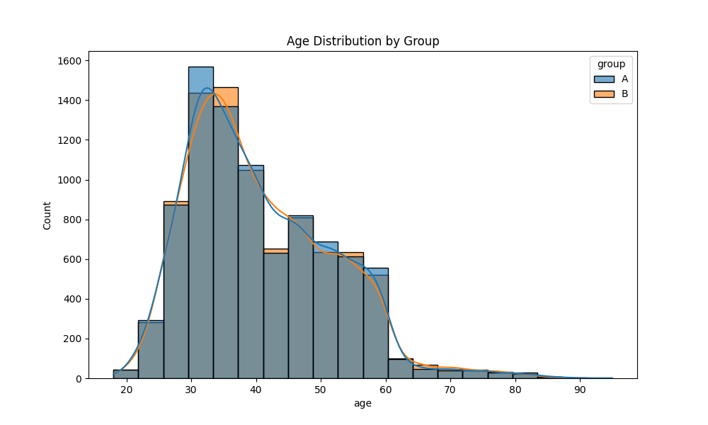
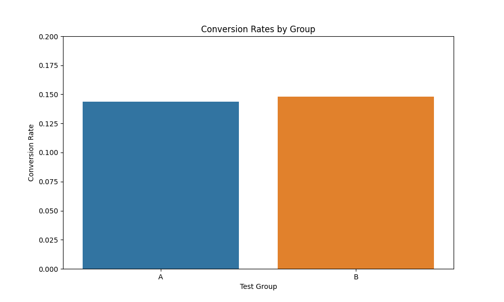

# 📈 A/B Testing Analysis: Bank Marketing Campaign

  
*Age distribution across test groups*

## 🌟 Key Insights
- **Minimal performance difference** between strategies (3.04% uplift)
- **No statistical significance** (p-value = 0.206)
- **Potential revenue opportunity** of $76,774 per 10,000 customers

## 📋 Table of Contents
- [Test Overview](#-test-overview)
- [Detailed Results](#-detailed-results)
- [Visual Analysis](#-visual-analysis)
- [Business Implications](#-business-implications)
- [Repository Structure](#-repository-structure)

## 🎯 Test Overview
**Objective:** Compare two telemarketing strategies for term deposit conversions  
**Dataset:** 17,544 customer contacts from Portuguese bank  
**Test Design:**
| Group | Strategy | Samples |
|-------|----------|---------|
| A | Control (Standard script) | 8,811 |
| B | Treatment (Personalized offer) | 8,733 |

**Analysis Period:** May 2025

## 📊 Detailed Results
### Conversion Performance
| Metric | Group A | Group B | Delta |
|--------|---------|---------|-------|
| Conversion Rate | 14.38% | 14.82% | +0.44% |
| p-value | 0.2059 | | |
| 95% CI | (13.5%, 15.3%) | (14.0%, 15.7%) | |

  
*Conversion rate comparison between groups*

### Demographic Breakdown
Key observations from age distribution:
- Similar participant distribution across groups
- Peak responsiveness in 30-50 age range
- No significant demographic biases detected

## 💼 Business Implications
**Projected Impact per 10,000 Contacts:**
```python
additional_conversions = (0.1482 - 0.1438) * 10000  # 44
revenue_gain = 44 * $1,745  # $76,774 (avg. deposit value)
```
**Recommendation:**  
- The treatment shows slight improvement but **not statistically significant**  
- Consider testing alternative incentives or channels  
- Maintain current strategy while investigating other optimization opportunities

🛠 Technical Implementation

### Analysis Tools  
- Python (Pandas, SciPy)  
- Tableau (Visualizations)  
- GitHub (Version Control)  

### Repository Structure  
```bash
.
├── data/                   # Raw datasets
├── scripts/                # python script
├── reports/                # Text reports
│   └── ab_test_report.txt  # Full numerical report
├── visuals/                # Charts and graphics
│   ├── age_distribution.png
│   └── image.png
└── README.md               # This document

